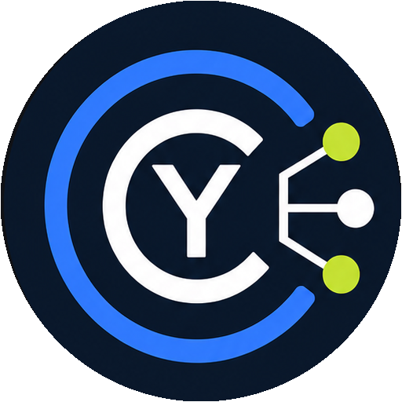

[English](README.md) | **Français**

<p align="center">
  
</p>

# CyTask

CyTask est un gestionnaire de projets et de tâches open source, auto-hébergeable,
conçu pour les équipes de production numérique et les projets Unreal Engine.

Le produit doit fonctionner avec ou sans dépôt Git. Git, Unreal Engine, les
traitements médias et CyRevision sont des intégrations autour d'un
cœur qui reste utilisable seul.

## Objectifs

- application Web rapide et installable, client Electron Windows/Linux/macOS, puis Android ;
- serveur d'équipe auto-hébergeable avec une sécurité vérifiable ;
- tâches, projets, sous-tâches, labels, commentaires, dépendances, pièces jointes et temps réel ;
- images et vidéos avec conversion locale optionnelle et traitement serveur ;
- commits, branches et demandes de fusion reliés aux tâches via un plugin Git ;
- panneau CyTask dans Unreal Engine 4.27 à 5.8 ;
- recettes d'assets contrôlées, prévisualisables et exécutables depuis Unreal ;
- extensions signées et limitées par permissions ;
- fondations compatibles avec un futur mode décentralisé CyRevision/Syncthing.

## État du dépôt

La première tranche verticale est implémentée : amorçage sécurisé du premier
compte, sessions, invitations à usage unique, rôles, organisation, projets,
tâches éditables avec contrôle de révision, sous-tâches, labels, checklists, commentaires et événements temps réel.
La recherche, le journal d’activité et l’export JSON sont également disponibles.
Le pipeline de pièces jointes calcule les empreintes côté client, envoie les données
par blocs vérifiés et conserve les originaux en quarantaine hors du Web. Un worker
d'analyse en sort chaque fichier : il parcourt réellement le conteneur PNG, JPEG,
GIF, WebP, MP4 ou WebM, refuse les fichiers tronqués ou dont le contenu ne
correspond pas au type annoncé, puis rend le fichier téléchargeable dans la seule
organisation qui l'a déposé. Les vidéos MP4 et WebM exposent leurs dimensions et leur
durée, se lisent directement dans la tâche et se déplacent dans la timeline grâce aux
requêtes de plage. Le réencodage et l'analyse antivirale restent à faire.
Les tâches peuvent aussi recevoir des références Git manuelles génériques ; aucun
dépôt ni secret n'est requis tant que le connecteur Git officiel n'est pas activé.
Le premier plugin Unreal source est également présent : panneau Slate, tâches personnelles et création auto-assignée, fichiers/assets historisés, connexion
PKCE dans le navigateur système, consultation des projets et tâches, révocation du
jeton, validateur strict et exécuteur confirmé de recettes d'assets. Le flux natif
utilise un code unique et un jeton Bearer opaque révocable réservé au client
`cytask-unreal` ; le jeton reste uniquement en mémoire dans l'éditeur.

La première plateforme de plugins déclaratifs est également disponible. Un administrateur
active Git, AI Assistant, Unreal Engine, CyRevision ou CyAnnota par projet depuis la page **Plugins**. AI Assistant gère plusieurs profils OpenAI, Anthropic, API compatible, Ollama, LM Studio, Codex, Claude Code ou OpenCode ; les jetons restent chiffrés côté serveur et chaque ticket choisit sa connexion. CyTask ajoute les onglets correspondants aux tickets et conserve leurs données structurées avec contrôle de révision. Les manifestes ne peuvent injecter ni JavaScript ni HTML : seuls les champs déclarés
et validés par le serveur sont rendus. Le connecteur compagnon CyRevision recherche les tickets,
ajoute leurs liens aux commits et pull requests, puis peut appliquer un état de fin après fusion.
Il compile sur UE 5.2 et 5.8 ; la validation 4.27 reste à répéter sur une installation
du moteur complète.
Le client Web responsive et installable consomme la même API que CyTask Desktop
Electron et le plugin Unreal. Le client desktop mémorise plusieurs IP ou domaines, isole les sessions par origine et
charge le site distant sans accès Node. Il peut aussi ouvrir un **dossier local** : un sidecar
auto-contenu limité à `127.0.0.1` conserve des snapshots immuables et des médias compatibles
avec Syncthing ou le moteur Sync de CyRevision, sans jamais répliquer une base active. Son interface de tâches propose maintenant cinq vues :
Liste, Compacte en colonnes, Kanban, Canvas libre multimédia et graphe relationnel.
Elle comprend également un thème clair/sombre, des dossiers et sous-dossiers persistants,
des labels colorés, priorités, échéances, assignations multiples, vues rapides et filtres nommés mémorisés localement.
La vue compacte se trie directement par chaque colonne et permet de modifier le statut, la priorité, l’échéance
ou les responsables sans ouvrir la fiche complète. Ses dossiers sont repliables et ses sélections par ligne,
par dossier ou globales permettent d’appliquer un statut, une priorité, une échéance ou plusieurs responsables à plusieurs tâches,
et d’ajouter ou retirer un dossier/label sans effacer les autres classements. Les colonnes visibles et leur ordre sont configurables,
réinitialisables et mémorisés par appareil ; les opérations groupées utilisent une concurrence bornée.
Chaque espace possède une bibliothèque commune où documents, canvas et fichiers serveur
peuvent être rangés dans les mêmes dossiers que les tâches, filtrés, regroupés et triés
par colonne. Les fichiers utilisent des blocs vérifiés par SHA-256 et le même passage en
quarantaine que les pièces jointes de tâches.
La discussion d’équipe fournit des salons par projet, messages, mentions, images, vidéos
et fichiers issus de cette bibliothèque. Le vocal et le partage d’écran reposent sur WebRTC avec une signalisation
WebSocket authentifiée. Le mode actuel est pair-à-pair direct ; un relais TURN privé
sera nécessaire pour les déploiements dont les membres sont séparés par des NAT ou
pare-feu stricts. Des groupes privés limitent côté serveur la liste des salons, les
messages et la signalisation aux seuls membres invités. Les liens de tâches génèrent
une carte ouvrable ; images et vidéos disposent d’un aperçu, d’une visionneuse
agrandie, d’un lecteur intégré et d’un téléchargement direct.
Elle propose aussi des vignettes et le téléchargement des fichiers validés, un motif pour les fichiers refusés,
drag-and-drop multi-fichier sur toute la fenêtre de tâche, galerie intégrée aux détails
et jusqu'à quatre aperçus image/vidéo par carte Kanban. Le Canvas permet d'ajouter
et déplacer des textes, formes, tâches, images et vidéos, ainsi que de dessiner à main
levée ; ses objets et blobs multimédias sont conservés localement dans le navigateur.
L’interface comprend aussi une palette de commandes `Ctrl/⌘ + K`, l’ajout rapide
d’une tâche en une ligne, le préchargement du détail au survol, la pagination serveur
à curseur avec filtres, le chargement progressif et des notifications non bloquantes.
Le déplacement optimiste utilise le contrôle de révision ; le détail reste organisé
en onglets et possède des liens directs partageables. Les tâches intègrent des checklists avec progression, une hiérarchie
parent/sous-tâches acyclique et des dépendances indiquant le travail qu'elles bloquent.
PostgreSQL est la persistance cible ; un stockage mémoire explicite est disponible
pour les tests et le développement rapide.

## Démarrage rapide

Avec Node.js 22 et le SDK local `.tools/dotnet` déjà installé :

```powershell
./scripts/dev.ps1
```

Ouvrir ensuite `http://127.0.0.1:5173`. Ce mode perd ses données au redémarrage.
Le même script lance la copie CyAnnota sur le port 5174 et la sert sous
`/plugins/cyannota/` via le domaine CyTask.
Pour PostgreSQL et le déploiement conteneurisé, voir [infra/README.md](infra/README.md).

Le client desktop se construit depuis `apps/client` :

```powershell
Push-Location apps/client
npm ci
npm run dist:win
Pop-Location
```

Pour remplir le serveur local avec le projet fictif **Nebula Station**, lancer dans
un second terminal pendant que le mode développement fonctionne :

```powershell
pwsh ./scripts/seed-demo.ps1
```

Le script crée une équipe et un jeu de charge de **220 tâches** réalistes avec états, priorités,
échéances, responsables, dossiers et sous-dossiers, ainsi que des sous-tâches, checklists, commentaires,
références Git et dépendances. Il active aussi les **5 plugins officiels** avec des données
Git, AI Assistant, Unreal et CyRevision, ainsi que CyAnnota pour les médias, puis ajoute **6 contenus d’espace**, **4 salons** et
une conversation d’exemple avec mentions et documents joints. Il est idempotent : une nouvelle exécution complète seulement les tâches
manquantes. Le jeu de démonstration ajoute également un groupe privé et un lien de
tâche prévisualisable. Les identifiants de démonstration sont affichés à la fin de son exécution.

L'API est utilisable par des plugins et des scripts sans passer par le flux Unreal :
un jeton personnel `cytask_pat_…` se crée depuis la section **API** du client Web,
avec une portée lecture ou lecture/écriture, une expiration optionnelle et une
révocation immédiate. Le contrat complet est servi par `/api/v1/openapi.json`.

```bash
curl -H "Authorization: Bearer cytask_pat_…" http://127.0.0.1:5080/api/v1/projects
```

## Documentation

- [Vision et périmètre](docs/01-vision-produit.md)
- [Architecture](docs/02-architecture.md)
- [Sécurité](docs/03-securite.md)
- [Feuille de route](docs/04-feuille-de-route.md)
- [Guide de développement](docs/05-developpement.md)
- [Interface des tâches](docs/06-interface-taches.md)
- [API pour plugins et intégrations](docs/07-api-plugins.md)
- [Annotations CyAnnota](docs/08-cyannota.md)
- [Mode local et synchronisation par dossier](docs/09-mode-local-sync.md)
- [Client desktop](apps/client/README.md)
- [Décisions d'architecture](docs/decisions)
- [Contrats de plugins](packages/contracts)
- [Plugin Unreal](integrations/unreal/README.md)

## Organisation prévue

```text
apps/                  serveur, Web et clients
integrations/unreal/   plugin Unreal et couches de compatibilité
packages/              contrats et SDK partagés
plugins/               plugins officiels, dont Git
infra/                 déploiement local et production
docs/                  produit, architecture, sécurité et décisions
```

## Vérifications

```powershell
./.tools/dotnet/dotnet test CyTask.slnx
Push-Location apps/web; npm run build; Pop-Location
Push-Location plugins/cyannota/web; npm run build; Pop-Location
Push-Location apps/client; npm run check; Pop-Location
```

Les commandes de construction et de tests Unreal sont documentées dans
[`integrations/unreal/README.md`](integrations/unreal/README.md).

## Licence

CyTask est distribué sous la licence
[GNU Affero General Public License v3.0](LICENSE), comme CyRevision. Les versions
modifiées proposées à travers un réseau doivent conserver les mêmes libertés et
mettre leur code source correspondant à disposition de leurs utilisateurs.
