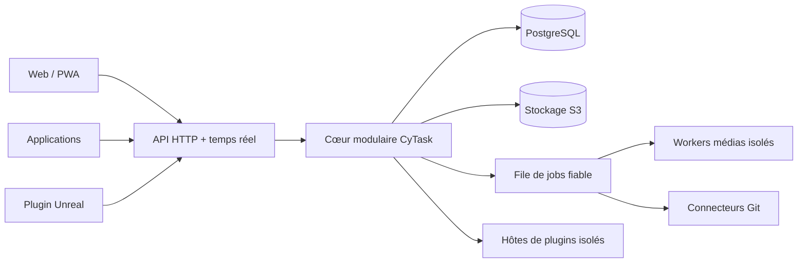

# Architecture cible

## Vue d'ensemble



## Forme du serveur

La première production sera un **monolithe modulaire** accompagné de workers. Les
modules partagent un déploiement, mais pas leurs modèles internes. Cela réduit les
communications réseau, les secrets et les pannes distribuées tout en laissant une
sortie claire aux composants réellement coûteux, notamment les médias.

Modules initiaux : identité, organisations, projets, tâches, commentaires,
notifications, fichiers, recherche, audit, plugins et intégrations.

Chaque mutation métier produit dans la même transaction :

- le nouvel état ;
- un événement d'outbox ;
- une révision monotone de l'entité.

L'outbox alimente le temps réel, les webhooks, les index et les futurs paquets de
synchronisation sans utiliser un double enregistrement fragile. Le dispatcher
PostgreSQL réserve les événements par bail avec `FOR UPDATE SKIP LOCKED`, réessaie
les erreurs avec temporisation et ne valide un événement qu'après sa publication.
Les événements traités restent sept jours par défaut pour permettre au flux SSE de
reprendre après un redémarrage avec `Last-Event-ID`.

## Données

- **PostgreSQL** : source de vérité transactionnelle et recherche initiale.
- **S3 compatible / MinIO** : originaux, variantes, exports et paquets de plugin.
- **Cache** : facultatif au départ ; il ne doit jamais être requis pour la
  correction métier.
- **Jobs** : table PostgreSQL fiable au départ, avec verrouillage concurrent,
  tentatives, échéance, idempotence et quarantaine. Un bus dédié pourra remplacer
  le transport sans changer les événements métier.

Les entités publiques utilisent des UUIDv7, un numéro de révision et des dates UTC.
Les clés lisibles comme `CY-142` restent des alias propres à un projet.

## API

- HTTP JSON versionné et décrit par OpenAPI pour commandes, requêtes et clients ;
- SSE durable pour les invalidations, avec rejeu borné et signal de resynchronisation ;
- WebSocket réservé aux futures présences et interactions bidirectionnelles ;
- URL signées à durée courte pour l'envoi et la lecture de fichiers ;
- curseurs opaques pour la pagination ;
- clés d'idempotence sur mutations réessayables ;
- identifiant de corrélation propagé du client aux workers.

Le contrat réseau est indépendant des modèles de base de données. Une version
mobile ou Unreal ancienne peut ainsi continuer à fonctionner pendant une période
de compatibilité annoncée.

## Pipeline média

1. Le client calcule une empreinte et demande une session d'envoi.
2. Il peut créer une variante optimisée localement et l'envoyer en plusieurs blocs.
3. Le serveur place l'objet en quarantaine et crée un job idempotent.
4. Un worker isolé détecte le format réel, applique limites et analyse de sécurité.
5. Images et vidéos sont décodées puis réencodées vers des profils maîtrisés.
6. Les variantes validées deviennent visibles et un événement notifie les clients.

Les étapes 1 à 4 et 6 sont implémentées. L'analyse actuelle parcourt réellement
le conteneur PNG, JPEG, GIF, WebP, MP4 ou WebM, refuse les fichiers tronqués et
borne les dimensions annoncées, sans dépendre d'un décodeur externe. Le type servi
provient toujours du contenu observé : un fichier annoncé comme média sans en être
un est refusé, et un format inconnu reste générique et téléchargeable seulement en
pièce jointe. L'étape 5 reste à faire, avec l'analyse antivirale.

L'application installée peut embarquer FFmpeg ; le Web utilise les capacités du
navigateur quand elles existent. Le worker serveur reste nécessaire pour obtenir
des sorties cohérentes. Les licences des codecs et de la distribution FFmpeg
doivent être auditées avant publication des binaires ; c'est cette décision, et non
le code, qui bloque aujourd'hui le réencodage.

## Modèle d'extensions

Trois classes évitent de donner les mêmes privilèges à toutes les extensions :

1. **Extension portable isolée** : logique déterministe dans un runtime sandboxé,
   sans réseau ni système de fichiers sauf capacités accordées.
2. **Connecteur de service** : processus ou conteneur séparé pour Git et les API
   externes, avec identité, limites réseau et secrets dédiés.
3. **Extension d'interface** : composant isolé communiquant avec une API hôte
   limitée, sans accès direct au jeton de session.

Un plugin déclare version d'API, points d'entrée, permissions, migrations et
compatibilité. Le serveur vérifie signature, empreinte, provenance et politique de
l'organisation avant activation. Le manifeste initial se trouve dans
`packages/contracts/plugin-manifest.schema.json`.

## Git comme plugin

Le cœur ne contient que les concepts de références externes et de liens. Le plugin
Git fournit dépôts, commits, branches, tags, demandes de fusion et états de CI.

Le premier contrat exécutable stocke déjà les références manuelles `commit`,
`branch`, `tag` et `merge_request`, avec un fournisseur et un dépôt. Une URL HTTPS
est facultative et n'est jamais appelée par le serveur. Le futur connecteur pourra
créer les mêmes enregistrements depuis ses webhooks sans modifier le modèle tâche.

- clés de tâche détectées dans message de commit, branche et demande de fusion ;
- liaison manuelle toujours disponible ;
- webhooks signés, anti-rejeu et idempotents ;
- clonage éventuel dans un worker sans secrets partagés ;
- protocoles, hôtes, taille, durée et redirections strictement limités ;
- adaptateurs GitHub/GitLab/Forgejo possibles au-dessus du modèle générique.

## Plugin Unreal

Le plugin est séparé en quatre couches :

```text
CyTaskCore          HTTP, auth, modèles portables, cache et file d'envoi
CyTaskEditor        Slate, panneau, commandes et intégration éditeur
CyTaskAssetRecipes  validation et exécution transactionnelle des recettes
CyTaskCompat_*      petits adaptateurs spécifiques aux familles de versions
```

La compatibilité 4.27–5.8 sera assurée par le code source et des artefacts compilés
par version/plateforme, pas par la promesse d'un unique binaire. Les recettes sont
validées par schéma, simulées, confirmées par l'utilisateur, exécutées sur le bon
thread et consignées. Le contrat initial est dans
`packages/contracts/unreal-asset-recipe.schema.json`.

## Clients

Le client Web responsive et installable est partagé avec CyTask Desktop. Le shell
Electron propose un sélecteur d’adresse serveur, une partition de session par origine
et une fenêtre distante sandboxée sans Node ni preload. Il fournit les permissions
natives nécessaires au vocal, aux notifications, au plein écran et au partage de la
fenêtre CyTask. CyAnnota reste un plugin Web intégré à la tâche et fonctionne donc
identiquement dans le navigateur et dans Electron. Android arrive après stabilisation
de l'API et des usages mobiles ; iOS n'est pas une exigence initiale mais ne doit pas
être rendu impossible.

## Préparation de CyRevision

Le futur plugin CyRevision échangera des **paquets de synchronisation** immuables et
signés : opérations, révisions, auteurs et références de blobs adressés par hash.
Syncthing transporte ces paquets ; il ne décide ni des droits ni des conflits.

Le serveur ou client CyRevision :

- valide signature et autorisation ;
- importe chaque opération de manière idempotente ;
- détecte les révisions concurrentes ;
- applique une règle métier ou crée un conflit visible ;
- produit un nouveau paquet au lieu de modifier un paquet déjà publié.
